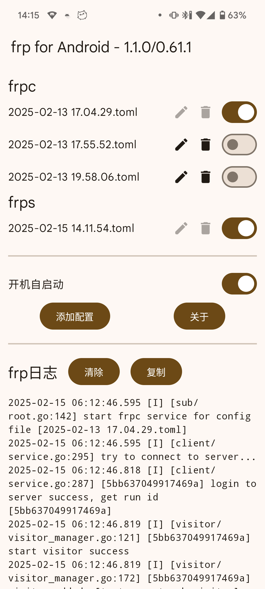
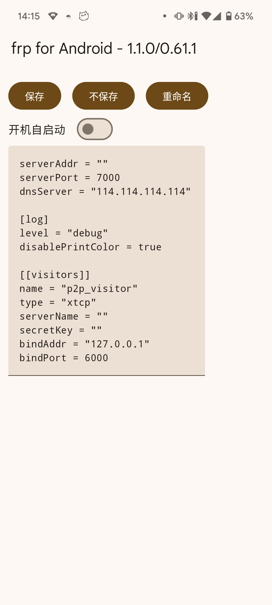

# frp-Android
A frp client for Android  
一个Android的frp客户端

简体中文 | [English](README_en.md)

<div style="display:inline-block">


</div>

## 编译方法

如果您想更换frp内核，可以通过Github Actions或通过Android Studio编译

下述密钥相关步骤可选，若跳过该步骤将会使用Android公开的默认调试密钥进行签名

### (推荐) 通过Github Actions编译

1. fork本项目
2. (可选) 将您的apk签名密钥文件转为base64，以下为Linux示例
```shell
base64 -w 0 keystore.jks > keystore.jks.base64
```
3. (可选) 转到Github项目的此页面：Settings > Secrets and variables > Actions > Repository secrets
4. (可选) 添加以下四个环境变量：```KEY_ALIAS``` ```KEY_PASSWORD``` ```STORE_FILE``` ```STORE_PASSWORD```其中```STORE_FILE```的内容为步骤2的base64，其他环境变量内容请根据您的密钥文件自行填写
5. 在Actions页面的Android CI手动触发或Push提交自动触发编译，手动触发时可输入指定的frp内核版本号tag进行下载(如v0.65.0)，留空和自动触发时下载最新版本

### 通过Android Studio编译

1. (可选) 在项目根目录创建apk签名密钥设置文件```keystore.properties```, 内容参考同级的```keystore.example.properties```
2. 参考[脚本说明](./scripts/README.md)运行`update_frp_binaries`脚本以获取最新的frp内核文件，或者手动下载并放置到相应目录下
3. 使用Android Studio进行编译打包

## 常见问题
### 项目的frp内核(libfrpc.so)是怎么来的？
直接从[frp的release](https://github.com/fatedier/frp/releases)里把对应ABI的Linux版本压缩包解压之后重命名frpc为libfrpc.so  
项目不是在代码里调用so中的方法，而是把so作为一个可执行文件，然后通过shell去执行对应的命令  
因为Golang的零依赖特性，所以可以直接在Android里通过shell运行可执行文件

### 连接重试
在 frpc 配置中添加 `loginFailExit = false` 可以设置第一次登陆失败后不退出，实现多次重试。  
可以适用于如下情况：开机自启动时，网络还未准备好，frpc 开始连接但失败，若不设置该选项则 frpc 会直接退出

### DNS解析失败
从 v1.3.0 开始，arm64-v8a 架构的设备将改用 android 类型的 frp 内核以解决 DNS 解析失败的问题。
armeabi-v7a 和 x86_64 架构的设备仍然使用 linux 类型的 frp 内核，可能会存在 DNS 解析失败的问题，建议在配置文件使用 `dnsServer` 指定 DNS 服务器

### 开机自启与后台保活
App 按照原生 Android 规范设计，然而部分国产系统拥有更严格的后台管控，请手动在系统设置内打开相应开关。例如 ColorOS 16 退到后台会断开连接，在【应用设置->耗电管理->完全允许后台行为】之后恢复正常

### 能在应用内更换内核版本吗？能内置多个frp内核吗？
简单来说：不能，请你参考上面的编译方法自行更换内核并编译Apk

由于[Android 10+ 移除了应用主目录的执行权限](https://developer.android.com/about/versions/10/behavior-changes-10?hl=zh-cn#execute-permission)，因此无法动态下载并运行新的frp内核文件，只能在安装包内置需要的内核版本。

用户的需求是不确定的，难以通过有限的内置版本满足所有用户，因此推荐用户自行编译以内置所需的内核版本。

当然也有其他的方案，例如

- [NekoBoxForAndroid](https://github.com/MatsuriDayo/NekoBoxForAndroid)开发了插件系统，可以将二进制文件分离出来作为Apk插件安装
- [termux](https://github.com/termux/termux-exec-package)通过一些技巧实现了在受限环境下执行二进制文件

但是这些方案都比较复杂，本人精力与能力有限，暂时无法实现

### BroadcastReceiver 使用示例
需在设置中打开「在收到广播时启动/关闭」对应开关：

```shell
# 启动所有已开启自启动的配置
adb shell am broadcast -a io.github.acedroidx.frp.START io.github.acedroidx.frp

# 停止所有已开启自启动的配置
adb shell am broadcast -a io.github.acedroidx.frp.STOP io.github.acedroidx.frp

# 仅操作指定配置（带参数示例）
adb shell am broadcast -a io.github.acedroidx.frp.START -e TYPE frpc -e NAME example.toml io.github.acedroidx.frp
adb shell am broadcast -a io.github.acedroidx.frp.STOP  -e TYPE frpc -e NAME example.toml io.github.acedroidx.frp
```

### ContentProvider 配置访问示例
使用前请在「设置 -> frp 配置读写接口」开启读/写开关，注意可能的配置密码泄露等安全风险。

```shell
# 列出全部配置（需要开启“允许读取”）
adb shell content query --uri content://io.github.acedroidx.frp.config

# 读取单个配置（需要开启“允许读取”）
adb shell content read --uri content://io.github.acedroidx.frp.config/frpc/example.toml

# 写入单个配置（需要开启“允许写入”）
# 将本地 example.toml 覆盖写入设备上的配置文件，部分设备可能需要先执行删除命令再写入
adb shell content write --uri content://io.github.acedroidx.frp.config/frpc/example.toml < example.toml

# 删除单个配置（需要开启“允许写入”）
adb shell content delete --uri content://io.github.acedroidx.frp.config/frpc/example.toml
```

- 应用内快速验证：在主页配置列表长按“编辑”按钮，会用第三方应用通过 ContentProvider 打开该配置文件，同样需要先在设置中开启读/写开关。
