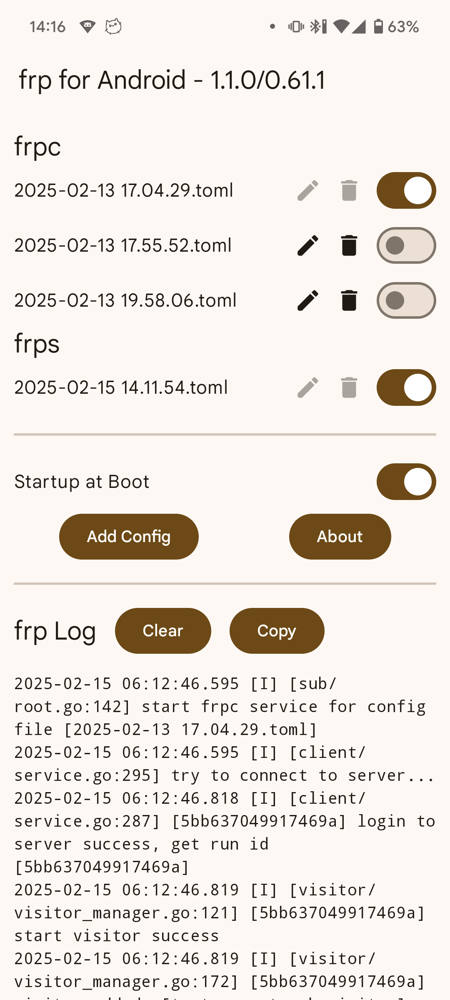
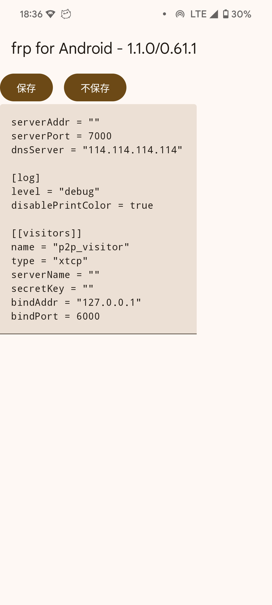

# frp-Android
A frp client for Android  
一个Android的frpc客户端

[简体中文](README.md) | English

<div style="display:inline-block">


</div>

## Compilation Methods

If you wish to customize the frp kernel, you can compile it via Github Actions or through Android Studio.

### Compiling via Github Actions

1. Convert your APK signing key file to base64; here's a Linux example:
```shell
base64 -w 0 keystore.jks > keystore.jks.base64
```
2. Fork this project.
3. Navigate to this page of the Github project: Settings > Secrets and variables > Actions > Repository secrets.
4. Add the following four environment variables:
```KEY_ALIAS``` ```KEY_PASSWORD``` ```STORE_FILE``` ```STORE_PASSWORD```  
The content for ```STORE_FILE``` should be the base64 from step 1, while you should fill in the other environment variables according to your key file.
5. A push commit will automatically trigger compilation, or you can manually trigger it on the Actions page.

### Compiling via Android Studio

1. Create an APK signing key configuration file named ```keystore.properties``` at the root directory of the project, referencing the existing ```keystore.example.properties``` file at the same level.
2. Compile and package using Android Studio.

## FAQs
### Where does the frp kernel (libfrpc.so) of the project come from?
It is obtained directly by extracting the corresponding ABI Linux version archive from [frp's release](https://github.com/fatedier/frp/releases), renaming frpc to libfrpc.so.  
The project does not invoke methods from the so file within its code but treats the so as an executable file, executing the corresponding command through shell.  
Due to Golang's zero-dependency characteristic, the executable file can be run directly through shell in Android.